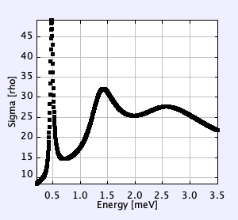

## A Java Program for Solving a Simple Quantum Scattering Problem
---------------

### Overview
---------------

This Java program models the H-Kr system using a Lennard–Jones (LJ) potential and solves the radial Schrödinger equation using the Numerov algorithm. It calculates the cross sections from the phase shifts and displays the results as a function of energy.

### Running the Program
---------------

To run the program, navigate to the `bin` directory and execute the following command:
```bash
cd bin
java ScatterApp
```

### Example Output
---------------

The program generates a plot of the total cross section as a function of energy, as shown below:



### Customization
---------------

You can modify the program to suit your needs and perform simulations for your own projects
involving the calculation of cross sections.

### Dependencies
---------------

* OpenSourcePhysics (OSP)
* JavaPlot
* jdistlib
